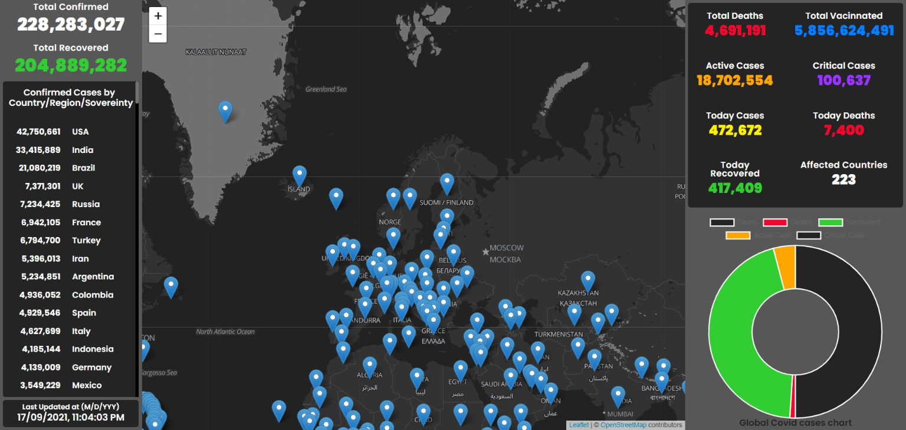

# Coronvirus Map Dashboard

My goal was to create an app to check Global Coronavirus cases with maps and chart



## Getting Started

NB: Install "yarn" if you have not, using
<code>npm install --global yarn</code>

1. Install dependencies <br>
   <code>yarn</code>

2. Start the server <br>
   <code>yarn start</code>

3. Happy coding! 😂🤗

## Libraries Used

-   Axios
-   use-axios-client - an axios library to fetch data
-   react-leaflet - A react wrapper for leaflet.js

## How I worked on this project

-   I used 'css modules' for styling
-   Used 'use-axios-client' an axios library, to handle HTTP requests.
-   I made use of 'leaflet.js' map to display the map

## How to navigate this project

-   Each individual components can be found inside the components folder
-   The pages can be found in the pages folder
-   All styles can be found in the styles folder

## Why I built the project this way

-   The application fetches Real Time Coronavirus cases data data from the [diseases api](https://disease.sh/docs/#/)
-   I used 'use-axios-client', an Axios library which make HTTP request and handling error easier. This helped me get to know how Axios work and how to use it.
-   I used 'react-leaflet' to load the leaflet map

## Challenges

-   I had challenges with displaying the map. The compiler was unable to compile the libary 'react-leaflet' code because it was using nullish coalescing (??). I solved this challenge by editing my package.json and putting:

```json
   "browserslist": [
		">0.2%",
		"not dead",
		"not op_mini all"
	]
```

and deleting the ".cache" folder in node_modules, then restarting the server.

## Author
- [Williams Samuel](https://williamssam.netlify.app/)
